# Let's Play

## 🐞 Where is the bug?

* **A**, **B**, and **C** are different entities.
* **A** produces invalid input.
* **B** takes that invalid input, and passes it to **C**.
* **C** doesn't like the input and drops it.

```dot process
digraph {
    rankdir = LR;

    node [
        shape     = circle
        style     = filled
        fontname  = "Monospace"
        fontsize  = 12
        color     = "#aaaabb"
        fillcolor = "#eeeef5"
        width     = 0.4
        height    = 0.4
    ]
    edge [
        fontname  = "Monospace"
        fontsize  = 10
    ]

    a [label = <<b>A</b>>]
    b [label = <<b>B</b>>]
    c [label = <<b>C</b>>]

    a -> b -> c
}
```

## Perspectives

A

Correct &ndash; if **A** is software.

But ☝️! if **A** means people, you are insulting the entire class of users.

B

Correct &ndash; if **B** should be a gatekeeper.

But **B** could also just be a blind transport channel.

C

Correct &ndash; if **C** should communicate back that the value is invalid.

But dropping invalid values could be completely okay.

There is no bug.

Correct &ndash; if unreliability is an acceptable design, like streaming a video.

