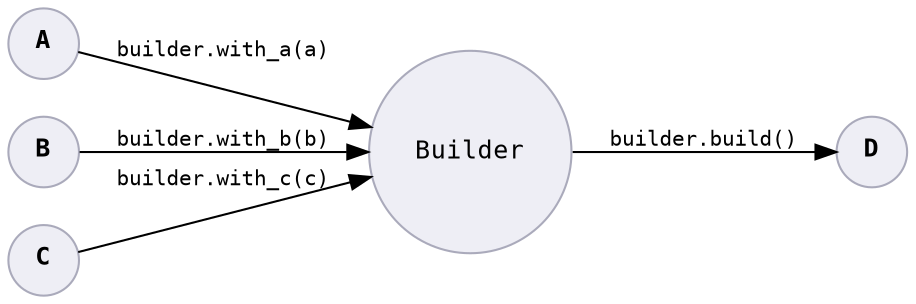

# Builder

> Never allow an object to be constructed unless it's correct.



Mapping multiple values into a single validated value.

Switch from:

```java
public class Data {
    private final byte byteValue;
    private final int intValue;
    private final Optional<String> stringValue;

    public Data(byte byteValue, int intValue, Optional<String> stringValue) {
        this.byteValue = byteValue;
        this.intValue = intValue;
        this.stringValue = stringValue;
    }

    // ..
}

// Consumer
Data data = new Data("abc", 1, Optional.empty());
```

to:

```java
public class Data {
    private final byte byteValue;
    private final int intValue;
    private final Optional<String> stringValue;

    // Package private to allow builder class access.
    Data(byte byteValue, int intValue, Optional<String> stringValue) {
        this.byteValue = byteValue;
        this.intValue = intValue;
        this.stringValue = stringValue;
    }

    // ..
}

public class DataBuilder {
    private final Optional<Byte> byteValue;
    private final Optional<Integer> intValue;
    private final Optional<String> stringValue;

    // Constructor
    // either:

    public DataBuilder() {
        this.byteValue = Optional.empty();
        this.integerValue = Optional.empty();
        this.stringValue = Optional.empty();
    }

    // or

    public DataBuilder(byte byteValue, int intValue) {
        this.byteValue = Optional.of((Byte) byteValue);
        this.integerValue = Optional.of((Integer) intValue);
        this.stringValue = Optional.empty();
    }

    // Append additional values.

    public DataBuilder withStringValue(String stringValue) {
        this.stringValue = Optional.of(stringValue);
        return this;
    }

    public DataBuilder withIntValue(int intValue) {
        this.intValue = Optional.of((Integer) intValue);
        return this;
    }

    public DataBuilder withStringValue(String stringValue) {
        this.stringValue = Optional.of(stringValue);
        return this;
    }

    public Data build() throws IncompatibleValuesException {
        byte byteValue = this.byteValue.get().byteValue();
        int intValue = this.intValue.get().intValue();

        if (intValue < (int) byteValue) {
            throw new IncompatibleValuesException(intValue, byteValue, "intValue must not be smaller than byteValue.");
        }

        return new Data(byteValue, intValue, this.stringValue());
    }

    // ..
}

// Consumer
Data data = new DataBuilder()
    .withByteValue(1)
    .withIntValue(1)
    .withStringValue("abc")
    .build(); // enforces constraints, may throw exception
```

## Bug Variants Addressed

* **1:** Raises an error<sup>1</sup> at the point of building.
* **2:** Reduces provider code working with invalid input, because only valid input reaches the business logic.
* **4:** Only allow groupings of valid values in the constructed type.
* **6:** Constrains input to a range of safe values.

<sup>1</sup> It is not a bug to raise an error.
