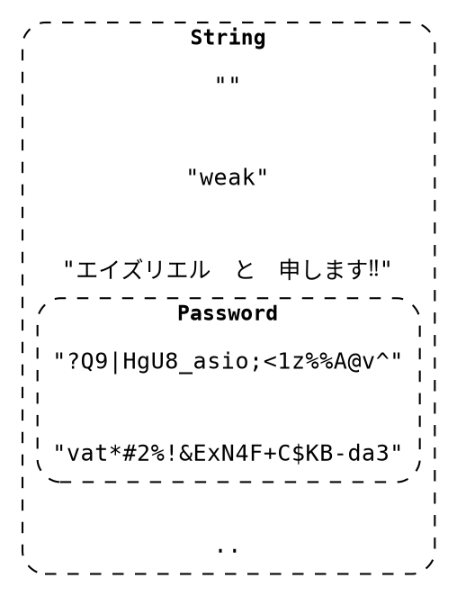

# Parse, Don't Validate

```dot process
digraph {
    node [
        shape     = circle
        style     = filled
        fontname  = "Monospace"
        fontsize  = 12
        color     = "#aaaabb"
        fillcolor = "#eeeef5"
        width     = 0.4
        height    = 0.4
    ]
    edge [
        fontname  = "Monospace"
        fontsize  = 10
    ]

    rankdir = LR;

    a [label = <<b>A</b>>]
    b [label = <<b>B</b>>]

    a -> b [label = <parser.parse(a)>]
}
```



Once you validate raw input, turn it into another type as proof that it is validated. The type safety stops the possibility of invalid values propagating far into the code.



**Parser:**

* Function that transforms an input type to a target type, iff it matches certain criteria.
* The target type's constructor must be restricted to the parser.

    Ensures the target type can never be constructed without going through the parser.

* Raise an error if the criteria is not met.

<!-- *When* a bug is discovered may actually be far from where it entered. -->

<details>
<summary><b>Example:</b> Updating a password only if the proposed value is strong.</summary>

Switch from:

```java
// Usage
void resetPassword(final String passwordProposed) throws PasswordTooWeakException {
    passwordChecker.check(passwordProposed);

    // password is strong

    passwordUpdater.update(profile, passwordProposed);
}

// our "validator"
public class PasswordChecker {
    public void check(String passwordProposed) throws PasswordTooWeakException {
        if (isStrong(passwordProposed)) {
            // ok!
            return;
        } else {
            throw new PasswordTooWeakException(passwordProposed);
        }
    }
}

// our provider
public class PasswordUpdater {
    public void update(Profile profile, String newPassword) { /* .. */ }
}
```

to:

```java
// Usage
void resetPassword(final String passwordProposed) throws PasswordTooWeakException {
    Password password = passwordChecker.check(passwordProposed);

    passwordUpdater.update(profile, password);
}

public class Password {
    private String value;

    // package private visibility
    Password(String value) { /* .. */ }
    // ..
}

// our "parser"
public class PasswordChecker {
    public Password check(String passwordProposed) throws PasswordTooWeakException {
        if (isStrong(passwordProposed)) {
            return new Password(passwordProposed);
        } else {
            throw new PasswordTooWeakException(passwordProposed);
        }
    }
}

// our provider
public class PasswordUpdater {
    public void update(Profile profile, Password newPassword) { /* .. */ }
}
```

</details>

<details>
<summary><b>Example:</b> Only accepting a list of one-or-more elements.</summary>

Switch from:

```java
void displaySuggestions(final List<Suggestion> suggestions) {
    // ..
}
```

to:

```java
void displaySuggestions(final ListMinOneElement<Suggestion> suggestions) {
    // ..
}

public <T> class ListMinOneElement<T> {
    private List<T> inner;

    private ListMinOneElement(List<T> inner) {
        this.inner = inner;
    }

    public static ListMinOneElement<T> tryFrom(List<T> maybeEmptyList)
            throws ListEmptyException {
        if (maybeEmptyList.isEmpty()) {
            throw new ListEmptyException(maybeEmptyList);
        } else {
            return new ListMinOneElement(maybeEmptyList);
        }
    }
}
```

</details>


## Bug Variants Addressed

* **1:** Raises an error<sup>1</sup> at the point of parsing.
* **2:** Reduces provider code working with invalid input, because only valid input reaches the business logic.
* **3:** Well-named restrictive types informs the consumer of constraints the input must adhere to, and parsing enforces the constraints.
* **6:** Constrains input to a range of safe values.

    If we have a list of safe commands that input is parsed into, then we protect ourselves from running unsafe logic.

<sup>1</sup> It is not a bug to raise an error.

## See Also

* [Parse, don’t validate](https://lexi-lambda.github.io/blog/2019/11/05/parse-don-t-validate/)
