# Parse, Don't Validate

```dot process
digraph {
    node [
        shape     = circle
        style     = filled
        fontname  = "Monospace"
        fontsize  = 12
        color     = "#aaaabb"
        fillcolor = "#eeeef5"
        width     = 0.4
        height    = 0.4
    ]
    edge [
        fontname  = "Monospace"
        fontsize  = 10
    ]

    rankdir = LR;

    a [label = <<b>A</b>>]
    b [label = <<b>B</b>>]

    a -> b [label = <parser.parse(a)>]
}
```



Once you validate raw input, turn it into another type as proof that it is validated. The type safety stops the possibility of invalid values propagating far into the code.

<!-- *When* a bug is discovered may actually be far from where it entered. -->

<details>
<summary><b>Example:</b> Validating a string matches criteria.</summary>

Switch from:

```java
void resetPassword(final String passwordProposed) throws PasswordTooWeakException {
    PasswordChecker.check(passwordProposed);

    // password is strong

    updatePassword(profile, passwordProposed);
}
```

to:

```java
void resetPassword(final String passwordProposed) throws PasswordTooWeakException {
    Password password = PasswordChecker.check(passwordProposed);

    updatePassword(profile, password);
}
```

</details>

<details>
<summary><b>Example:</b> One-or-more elements restricted list.</summary>

Switch from:

```java
void displaySuggestions(final List<String> suggestions) {
    // ..
}
```

to:

```java
void displaySuggestions(final ListMinOneElement<String> suggestions) {
    // ..
}

public <T> class ListMinOneElement<T> {
    private List<T> inner;

    private ListMinOneElement(List<T> inner) {
        this.inner = inner;
    }

    public static List<T> tryFrom(List<T> maybeEmptyList) throws ListEmptyException {
        if (maybeEmptyList.isEmpty()) {
            throw new ListEmptyException(maybeEmptyList);
        } else {
            return new ListMinOneElement(maybeEmptyList);
        }
    }
}
```

</details>

## Bug Variants Addressed

* **1:** Raises an error<sup>1</sup> at the point of parsing.
* **2:** Reduces provider code working with invalid input, because only valid input reaches the business logic.
* **3, 7:** Well-named restrictive types informs the consumer of constraints they must adhere to, and parsing enforces the constraints.
* **6:** Constrains input to a range of safe values.

<sup>1</sup> It is not a bug to raise an error.

## See Also

* [Parse, don’t validate](https://lexi-lambda.github.io/blog/2019/11/05/parse-don-t-validate/)
