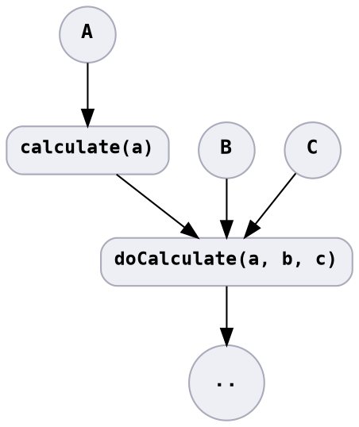

# Detached Parameters Incorrect

For the same input from the consumer, provider returns different output due to calculation using other state.

* Environmental variables
* Configuration

The bug may be outside of the source code. Configuration is deferred code.
